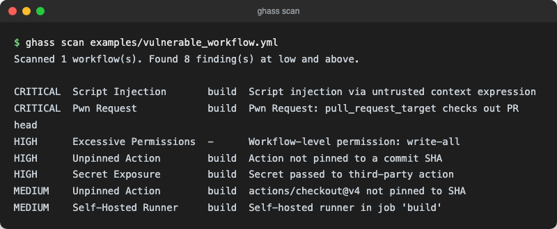

<div align="center">
  
  <h1>GitHub Actions Security Sandbox Simulator</h1>
</div>

> 🇩🇪 [Deutsche Version](README.de.md)

**Static analysis and attack simulation for GitHub Actions workflows. Detects injection vectors, supply chain risks, excessive permissions and secret exposure. Generates prioritized findings with remediation guidance.**

Aligned with [Microsoft Security DevOps](https://learn.microsoft.com/en-us/azure/defender-for-cloud/azure-devops-extension) principles. SARIF 2.1.0 output integrates natively with [GitHub Advanced Security (GHAS)](https://docs.github.com/en/get-started/learning-about-github/about-github-advanced-security) code scanning for enterprise security workflows.

[](https://github.com/9t29zhmwdh-coder/github-actions-security-sandbox/actions)     [](https://github.com/9t29zhmwdh-coder/github-actions-security-sandbox/releases) [](LICENSE)

> **How it runs:** This is a command-line tool, not a desktop app and not a server. `ghass scan` runs once against local YAML files and exits; there is no installer and no background process. It never contacts GitHub or runs any of the scanned workflows, it only reads the YAML.



---

> 🌱 New here? → [Step-by-step guide for beginners](GETTING_STARTED.md)

---

**In practice:** point it at your `.github/workflows` folder and get a prioritized table of real, exploitable misconfigurations (script injection, pwn requests, unpinned actions, secret exposure) straight in your terminal, or export as SARIF for GitHub Advanced Security.

## Detected Attack Vectors

| Attack Vector | Severity | CWE |
|---|---|---|
| Script injection via untrusted context expressions | Critical | CWE-78 |
| Pwn Request (pull_request_target + PR head checkout) | Critical | CWE-913 |
| Excessive permissions (write-all, contents: write) | High | CWE-250 |
| Secrets passed to third-party actions | High | CWE-522 |
| Unpinned actions (mutable branch reference) | High | CWE-829 |
| Unpinned actions (semantic version tag) | Medium | CWE-829 |
| Self-hosted runner without isolation | Medium | CWE-653 |
| Secret values in environment variables | Informational | CWE-532 |

---

## Requirements

- Rust (stable toolchain, edition 2021) — install via https://rustup.rs
- Cargo (comes bundled with Rust)
- Git (optional, only needed if you clone instead of downloading the ZIP)
- No GitHub token, Docker, or other credentials needed — the tool only reads local YAML files

## Quick Start

```bash
git clone https://github.com/9t29zhmwdh-coder/github-actions-security-sandbox
cd github-actions-security-sandbox
cargo build --release

# Scan a single workflow file
./target/release/ghass scan examples/vulnerable_workflow.yml

# Scan all workflows in a directory
./target/release/ghass scan .github/workflows

# Export findings as Markdown
./target/release/ghass scan .github/workflows --format md --output report.md

# Export SARIF for GitHub Advanced Security
./target/release/ghass scan .github/workflows --format sarif --output results.sarif

# Show only high severity and above
./target/release/ghass scan .github/workflows --min-severity high
```

---

## Uninstall / Cleanup

Delete the `target/` build directory and any exported report files (`report.md`, `results.sarif`, etc.). The tool never writes anywhere else, it only reads workflow YAML files.

---

## Output Formats

| Format | Flag | Use Case |
|---|---|---|
| Table (default) | `--format table` | Interactive terminal inspection |
| JSON | `--format json` | CI pipelines, ticketing system integration |
| Markdown | `--format md` | PR comments, Confluence, internal reports |
| HTML | `--format html` | Browser-viewable reports for stakeholders |
| SARIF | `--format sarif` | GitHub Advanced Security, code scanning |

---

## Finding Severity

| Severity | Description |
|---|---|
| Critical | Immediate code execution risk or full secret exposure. Fix before merging. |
| High | Significant risk that can be exploited with moderate effort. |
| Medium | Risk requires specific conditions to exploit; remediate in next sprint. |
| Low | Defense-in-depth improvement with limited direct impact. |
| Informational | Correct usage pattern; review for completeness. |

---

## Architecture

The tool is structured as a Rust workspace with three crates:

| Crate | Role |
|---|---|
| `ghass-core` | Domain models, finding types, report serialization (JSON, Markdown, HTML, SARIF) |
| `ghass-scan` | YAML workflow parser, all security analyzers |
| `ghass-cli` | CLI binary (`ghass`), output formatting, severity filtering |

See [ARCHITECTURE.md](ARCHITECTURE.md) for the full data-flow diagram and module descriptions.

---

## GitHub Action Integration

Copy `.github/workflows/ghass-check-template.yml` from this repository into your own project to automatically scan workflows on every push and on a weekly schedule. Findings are uploaded to GitHub Advanced Security as SARIF results.

See [docs/attack_vectors.md](docs/attack_vectors.md) for hardening patterns for each finding type.

---

## No Credentials Required

This tool performs entirely local static analysis. It reads YAML files from disk. No Azure, GitHub, or any other API credentials are needed or used.

---

**Author:** [Rafael Yilmaz](https://github.com/9t29zhmwdh-coder) · **Status:** Active ·  · **License:** MIT
